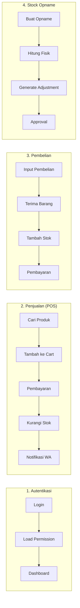

# BAB IV

# IMPLEMENTASI DAN PENGUJIAN

Bab ini membahas implementasi sistem Point of Sale (POS) terintegrasi berbasis teknologi finansial yang telah dikembangkan untuk Toko Ban dan Velg Omah Ban. Pembahasan mencakup gambaran umum sistem, lingkungan pengembangan, implementasi basis data, proses bisnis, antarmuka pengguna, fungsi backend, pengujian sistem, serta evaluasi pengguna.

---

## 4.1 Gambaran Umum Implementasi Sistem

### 4.1.1 Ringkasan Sistem yang Diimplementasikan

Sistem POS Omah Ban merupakan aplikasi berbasis web yang dikembangkan menggunakan framework Laravel 10 dengan arsitektur modular. Sistem ini dirancang untuk mendigitalisasi proses penjualan, pembelian, dan pengelolaan stok di toko ban dan velg. Aplikasi ini menyediakan solusi komprehensif yang mencakup:

1. **Manajemen Transaksi Penjualan** — Proses checkout di kasir dengan dukungan berbagai metode pembayaran (tunai, transfer bank, dan Midtrans/QRIS).
2. **Pengelolaan Inventaris** — Pencatatan produk baru dan bekas dengan tracking stok real-time.
3. **Pencatatan Pembelian** — Dokumentasi pembelian dari supplier dengan sistem pembayaran cicilan.
4. **Pelaporan Bisnis** — Laporan harian, laba-rugi, dan analisis performa penjualan.
5. **Notifikasi Real-time** — Pemberitahuan otomatis ke owner via WhatsApp untuk transaksi penting.

### 4.1.2 Modul yang Diimplementasikan

Sistem dikembangkan dengan pendekatan modular menggunakan package `nwidart/laravel-modules`. Tabel berikut merangkum modul-modul yang telah diimplementasikan:

| No  | Modul          | Deskripsi                                                                            | Entitas Utama                                                                                         |
| --- | -------------- | ------------------------------------------------------------------------------------ | ----------------------------------------------------------------------------------------------------- |
| 1   | **Sale**       | Modul transaksi penjualan di kasir (POS), pembayaran, retur penjualan, dan quotation | `Sale`, `SaleDetails`, `SalePayment`, `SaleReturn`, `SaleReturnDetail`, `Quotation`, `ManualInputLog` |
| 2   | **Product**    | Modul pengelolaan produk baru dan bekas, kategori, brand, dan layanan jasa           | `Product`, `ProductSecond`, `Category`, `Brand`, `ServiceMaster`, `StockLedger`                       |
| 3   | **Purchase**   | Modul pembelian produk dari supplier termasuk pembelian barang bekas                 | `Purchase`, `PurchaseDetail`, `PurchasePayment`, `PurchaseSecond`, `PurchaseSecondDetail`             |
| 4   | **People**     | Modul manajemen customer dan supplier dengan riwayat transaksi                       | `Customer`, `Supplier`                                                                                |
| 5   | **Expense**    | Modul pencatatan pengeluaran operasional dengan kategori                             | `Expense`, `ExpenseCategory`                                                                          |
| 6   | **Adjustment** | Modul penyesuaian stok, stock opname, dan log pergerakan stok                        | `Adjustment`, `AdjustedProduct`, `StockOpname`, `StockOpnameItem`, `StockMovement`, `AdjustmentLog`   |
| 7   | **Reports**    | Modul pelaporan dengan berbagai jenis laporan bisnis                                 | Komponen Livewire untuk laporan                                                                       |
| 8   | **User**       | Modul manajemen pengguna, role, dan permission                                       | `User`, `Role`, `Permission`                                                                          |
| 9   | **Setting**    | Modul pengaturan sistem seperti kop surat dan satuan unit                            | `Setting`, `Unit`, `MasterKopSurat`                                                                   |
| 10  | **Currency**   | Modul konfigurasi mata uang dan format angka                                         | `Currency`                                                                                            |

### 4.1.3 Role dan Batasan Akses

Sistem mengimplementasikan Role-Based Access Control (RBAC) menggunakan package Spatie Permission. Terdapat tiga role utama dengan pembagian tanggung jawab sebagai berikut:

| Role             | Tanggung Jawab                                                                     | Akses Utama                                                                     |
| ---------------- | ---------------------------------------------------------------------------------- | ------------------------------------------------------------------------------- |
| **Owner/Admin**  | Mengelola seluruh aspek bisnis, melihat laporan lengkap, mengatur user dan sistem  | Akses penuh ke semua modul, menerima notifikasi WhatsApp, menyetujui adjustment |
| **Kasir**        | Memproses transaksi penjualan di POS, menerima pembayaran, mengelola customer      | POS checkout, manajemen customer, lihat laporan terbatas                        |
| **Admin Gudang** | Mengelola stok barang, membuat adjustment, input pembelian, melakukan stock opname | Manajemen produk, pembelian, adjustment stok, stock opname                      |

#### Matriks Permission per Role

Tabel berikut menunjukkan pembagian permission untuk setiap role dalam sistem:

| Permission                 | Owner/Admin |     Kasir     | Admin Gudang  |
| -------------------------- | :---------: | :-----------: | :-----------: |
| Akses Dashboard            |     ✅      | ✅ (terbatas) | ✅ (terbatas) |
| Akses POS                  |     ✅      |      ✅       |      ❌       |
| Buat Transaksi Penjualan   |     ✅      |      ✅       |      ❌       |
| Edit Harga di POS          |     ✅      |      ✅       |      ❌       |
| Lihat Laporan Lengkap      |     ✅      |      ❌       |      ❌       |
| Export Laporan (Excel/PDF) |     ✅      |      ❌       |      ❌       |
| CRUD Produk                |     ✅      |      ❌       |      ✅       |
| CRUD Customer              |     ✅      |      ✅       |      ❌       |
| CRUD Supplier              |     ✅      |      ❌       |      ✅       |
| Buat Pembelian             |     ✅      |      ❌       |      ✅       |
| Stock Adjustment           |     ✅      |      ❌       |      ✅       |
| Approve Adjustment         |     ✅      |      ❌       |      ❌       |
| Stock Opname               |     ✅      |      ❌       |      ✅       |
| Kelola User & Role         |     ✅      |      ❌       |      ❌       |
| Akses Pengaturan           |     ✅      |      ❌       |      ❌       |
| Terima Notifikasi WhatsApp |     ✅      |      ❌       |      ❌       |

> **Catatan**: Sistem menggunakan _single-level approval_ untuk adjustment stok. Artinya, hanya Owner/Admin yang dapat menyetujui atau menolak adjustment yang dibuat oleh Admin Gudang, tanpa mekanisme multi-level approval.

### 4.1.4 Ringkasan Proses Bisnis Utama

Sistem mendukung empat proses bisnis utama yang saling terintegrasi:

**Penjelasan Proses:**

1. **Autentikasi**: User login ke sistem, sistem memuat role dan permission, kemudian mengarahkan ke dashboard sesuai hak akses.

2. **Penjualan (POS)**: Kasir mencari produk, menambahkan ke cart, memproses pembayaran (cash/transfer/Midtrans), sistem otomatis mengurangi stok dan mengirim notifikasi ke owner jika ada item manual.

3. **Pembelian**: Admin Gudang menginput pembelian dari supplier, menerima barang dan memperbarui stok, lalu mencatat pembayaran (bisa cicilan).

4. **Stock Opname**: Admin Gudang membuat sesi opname, menghitung stok fisik, sistem menghasilkan adjustment jika ada selisih, Owner menyetujui/menolak adjustment tersebut.

### 4.1.5 Kriteria Keberhasilan Implementasi

Berdasarkan tujuan penelitian yang ditetapkan pada BAB I, kriteria keberhasilan implementasi sistem adalah:

| No  | Kriteria            | Target                         | Metode Pengukuran                 |
| --- | ------------------- | ------------------------------ | --------------------------------- |
| 1   | Waktu transaksi POS | < 2 menit per transaksi        | Observasi waktu checkout          |
| 2   | Notifikasi WhatsApp | Real-time (< 10 detik)         | Pengujian pengiriman pesan        |
| 3   | Akurasi stok        | Selisih < 1% setelah opname    | Perbandingan stok fisik vs sistem |
| 4   | Export laporan      | Semua laporan dapat di-export  | Black-box testing                 |
| 5   | Multi-user access   | 3+ user simultan tanpa konflik | Pengujian konkuren                |

---

_[Lanjut ke Bagian 4.2 Lingkungan Pengembangan dan Implementasi]_
