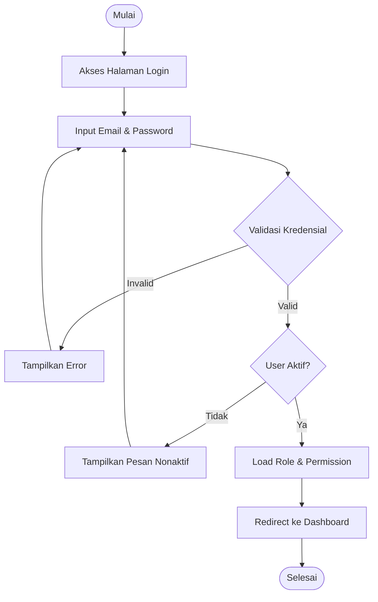
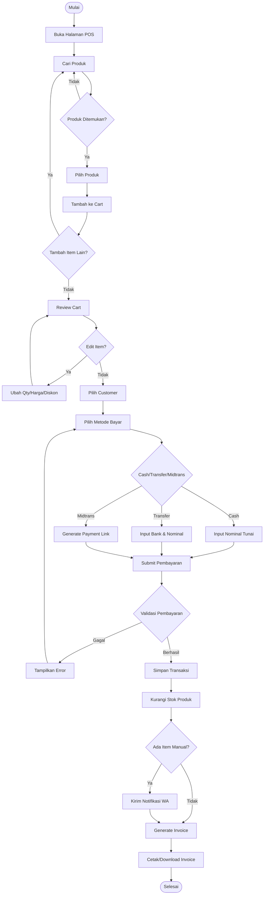
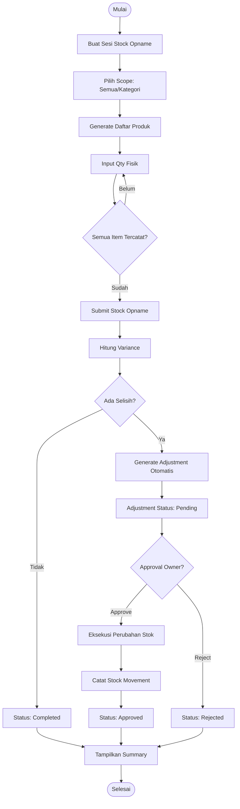
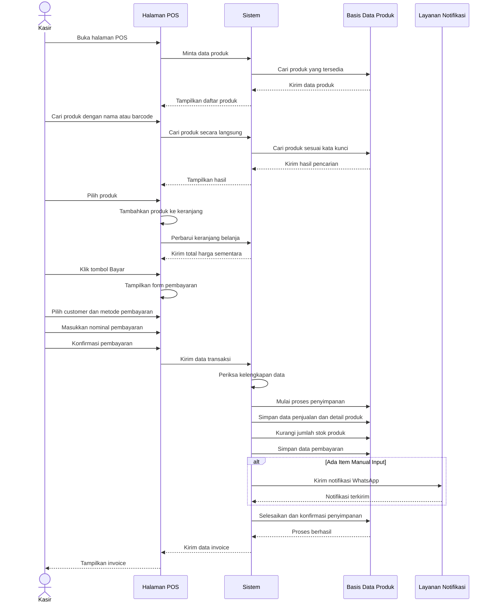
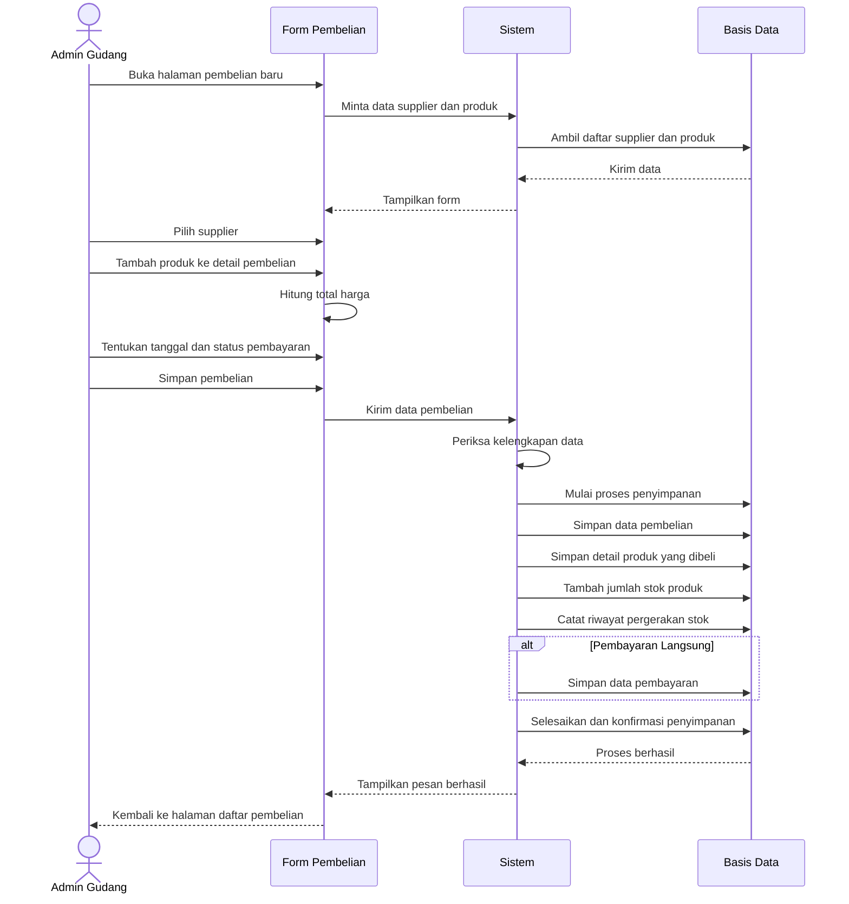
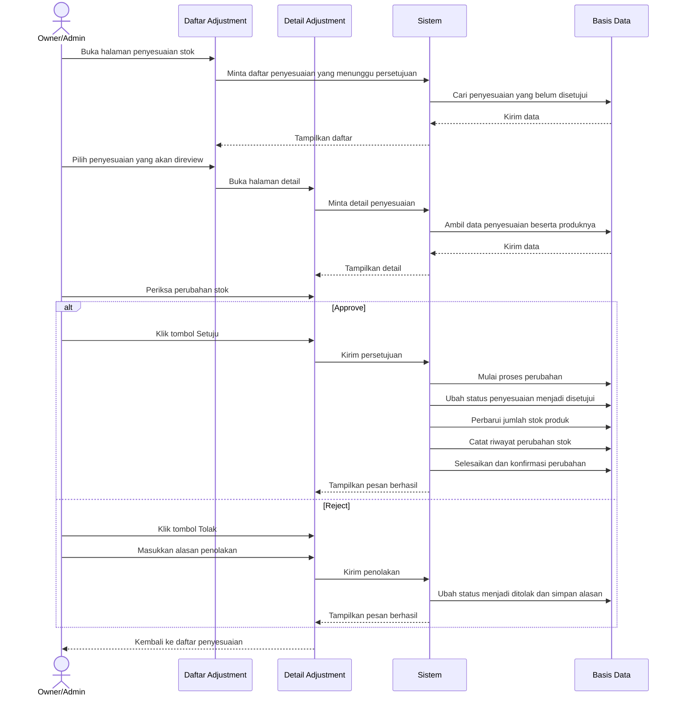
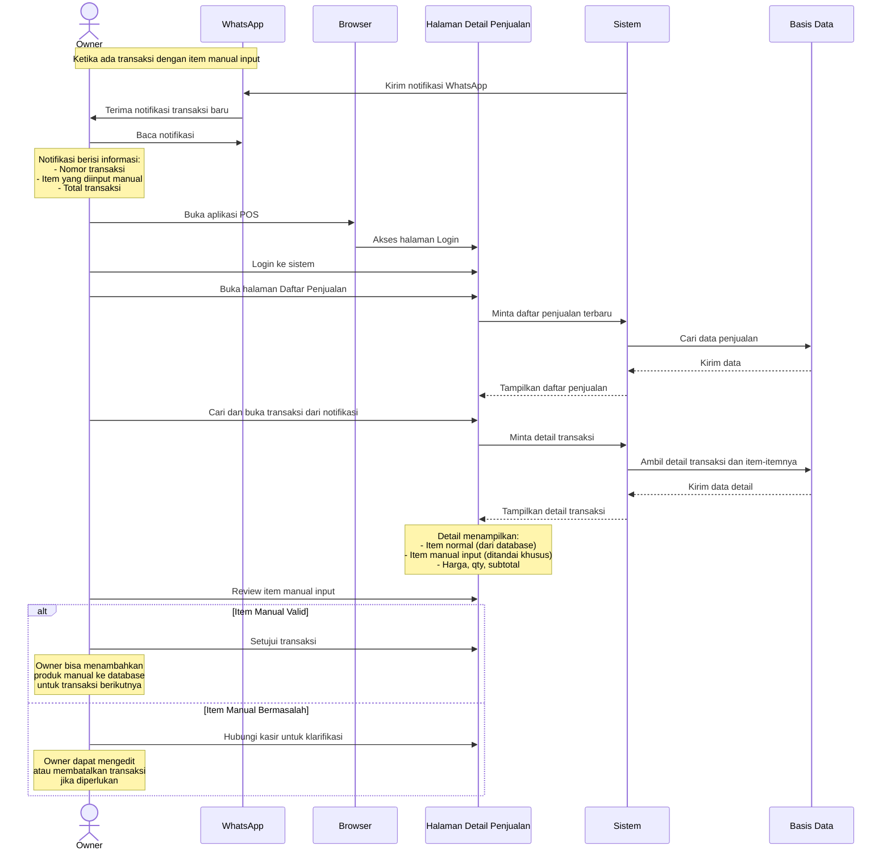

# BAB IV

# HASIL DAN PEMBAHASAN

Bab ini membahas hasil implementasi Sistem Point of Sale (POS) terintegrasi berbasis teknologi finansial yang telah dikembangkan untuk Toko Ban dan Velg Omah Ban. Pembahasan mencakup perencanaan sistem, hasil tampilan website, serta pengujian sistem.

---

## 4.1 Perencanaan Sistem

Pada subbab ini akan dijelaskan perencanaan sistem yang meliputi diagram Use Case, Flowchart, Diagram Activity, dan Entity Relationship Diagram (ERD). Perencanaan sistem ini menjadi dasar dalam pengembangan Sistem POS Omah Ban.

### 4.1.1 Diagram Use Case

Diagram Use Case menggambarkan interaksi antara aktor (pengguna) dengan sistem. Sistem POS Omah Ban memiliki tiga aktor utama yaitu Owner/Admin, Kasir, dan Admin Gudang.

```mermaid
%%{init: {'theme': 'base', 'themeVariables': { 'fontSize': '14px'}}}%%
flowchart TB
    subgraph SYSTEM["Sistem POS Omah Ban"]
        UC1([Login])
        UC2([Lihat Dashboard])
        UC3([Kelola Produk])
        UC4([Kelola Produk Second])
        UC5([Kelola Kategori & Brand])
        UC6([Transaksi POS])
        UC7([Kelola Penjualan])
        UC8([Kelola Retur Penjualan])
        UC9([Kelola Pembelian])
        UC10([Kelola Customer])
        UC11([Kelola Supplier])
        UC12([Kelola Pengeluaran])
        UC13([Stock Adjustment])
        UC14([Stock Opname])
        UC15([Lihat Laporan])
        UC16([Export Laporan])
        UC17([Kelola User & Role])
        UC18([Kelola Pengaturan])
        UC19([Terima Notifikasi WA])
        UC20([Kelola Quotation])
    end

    OWNER((Owner/Admin))
    KASIR((Kasir))
    GUDANG((Admin Gudang))

    %% Owner - Full Access
    OWNER --> UC1
    OWNER --> UC2
    OWNER --> UC3
    OWNER --> UC4
    OWNER --> UC5
    OWNER --> UC6
    OWNER --> UC7
    OWNER --> UC8
    OWNER --> UC9
    OWNER --> UC10
    OWNER --> UC11
    OWNER --> UC12
    OWNER --> UC13
    OWNER --> UC14
    OWNER --> UC15
    OWNER --> UC16
    OWNER --> UC17
    OWNER --> UC18
    OWNER --> UC19
    OWNER --> UC20

    %% Kasir
    KASIR --> UC1
    KASIR --> UC2
    KASIR --> UC6
    KASIR --> UC7
    KASIR --> UC10
    KASIR --> UC20

    %% Admin Gudang
    GUDANG --> UC1
    GUDANG --> UC2
    GUDANG --> UC3
    GUDANG --> UC4
    GUDANG --> UC5
    GUDANG --> UC9
    GUDANG --> UC11
    GUDANG --> UC13
    GUDANG --> UC14
```

**Gambar 4.1** Diagram Use Case Sistem POS Omah Ban

**Tabel 4.1** Deskripsi Use Case Sistem POS Omah Ban

| No | Use Case | Deskripsi | Aktor |
|----|----------|-----------|-------|
| 1 | Login | User melakukan autentikasi untuk masuk ke sistem dengan email dan password | Semua |
| 2 | Lihat Dashboard | User melihat ringkasan statistik bisnis (penjualan, pembelian, profit) | Semua |
| 3 | Kelola Produk | CRUD data produk baru (ban, velg, aksesoris) | Owner, Admin Gudang |
| 4 | Kelola Produk Second | CRUD data produk bekas dengan kondisi dan harga khusus | Owner, Admin Gudang |
| 5 | Kelola Kategori & Brand | CRUD kategori produk dan merek/brand | Owner, Admin Gudang |
| 6 | Transaksi POS | Membuat transaksi penjualan di kasir dengan berbagai metode pembayaran | Owner, Kasir |
| 7 | Kelola Penjualan | Melihat, mengedit, dan menghapus data penjualan | Owner, Kasir |
| 8 | Kelola Retur Penjualan | Memproses pengembalian barang dari customer | Owner |
| 9 | Kelola Pembelian | CRUD transaksi pembelian dari supplier | Owner, Admin Gudang |
| 10 | Kelola Customer | CRUD data pelanggan beserta riwayat transaksi | Owner, Kasir |
| 11 | Kelola Supplier | CRUD data supplier/pemasok produk | Owner, Admin Gudang |
| 12 | Kelola Pengeluaran | Mencatat pengeluaran operasional dengan kategori | Owner |
| 13 | Stock Adjustment | Melakukan penyesuaian stok manual dengan alasan | Owner, Admin Gudang |
| 14 | Stock Opname | Melakukan penghitungan stok fisik dan sinkronisasi dengan sistem | Owner, Admin Gudang |
| 15 | Lihat Laporan | Melihat berbagai laporan bisnis (harian, laba-rugi, stok) | Owner |
| 16 | Export Laporan | Mengunduh laporan dalam format Excel atau PDF | Owner |
| 17 | Kelola User & Role | CRUD data user, role, dan permission | Owner |
| 18 | Kelola Pengaturan | Mengatur konfigurasi sistem (kop surat, satuan, dll) | Owner |
| 19 | Terima Notifikasi WA | Menerima notifikasi otomatis via WhatsApp untuk transaksi penting | Owner |
| 20 | Kelola Quotation | Membuat dan mengelola penawaran harga untuk customer | Owner, Kasir |

---

### 4.1.2 Flowchart

Flowchart menggambarkan alur proses utama dalam sistem. Berikut adalah flowchart untuk proses-proses penting dalam Sistem POS Omah Ban.

#### A. Flowchart Proses Login

**Gambar 4.2** Flowchart Proses Login

#### B. Flowchart Proses Transaksi POS

**Gambar 4.3** Flowchart Proses Transaksi POS

#### C. Flowchart Proses Stock Opname

**Gambar 4.4** Flowchart Proses Stock Opname

---

### 4.1.3 Diagram Activity

Diagram Activity menggambarkan alur aktivitas yang dilakukan oleh aktor dalam sistem. Berikut adalah diagram activity untuk proses-proses utama.

#### A. Diagram Activity Proses Transaksi POS

**Gambar 4.5** Diagram Activity Proses Transaksi POS

**Penjelasan Proses:**

Proses transaksi POS dimulai ketika kasir membuka halaman POS dan sistem menampilkan daftar produk yang tersedia. Kasir kemudian mencari produk menggunakan nama atau barcode, dan sistem akan menampilkan hasil pencarian secara langsung. Setelah produk ditemukan, kasir memilih produk dan menambahkannya ke keranjang belanja. Sistem akan menghitung dan menampilkan total harga sementara.

Ketika kasir selesai memilih produk, kasir menekan tombol Bayar dan sistem menampilkan form pembayaran. Kasir kemudian memilih customer (jika ada) dan metode pembayaran yang diinginkan, lalu memasukkan nominal pembayaran. Setelah kasir mengkonfirmasi pembayaran, sistem akan menerima data transaksi dan melakukan pemeriksaan kelengkapan data.

Jika data lengkap dan valid, sistem mulai menyimpan transaksi dengan langkah-langkah: menyimpan data penjualan beserta detail produknya, mengurangi jumlah stok produk yang terjual, dan menyimpan data pembayaran. Jika ada produk yang diinput secara manual (bukan dari database), sistem akan mengirim notifikasi WhatsApp kepada owner. Setelah semua proses selesai, sistem mengonfirmasi penyimpanan dan mengirim data invoice ke halaman POS untuk ditampilkan kepada kasir.

#### B. Diagram Activity Proses Pembelian

**Gambar 4.6** Diagram Activity Proses Pembelian

**Penjelasan Proses:**

Proses pembelian dimulai ketika Admin Gudang membuka halaman pembelian baru. Sistem kemudian mengambil dan menampilkan daftar supplier dan produk yang tersedia dalam form pembelian. Admin Gudang memilih supplier yang akan digunakan untuk transaksi pembelian, lalu menambahkan produk-produk yang akan dibeli ke dalam detail pembelian. Sistem secara otomatis menghitung total harga pembelian.

Setelah semua produk ditambahkan, Admin Gudang menentukan tanggal pembelian dan status pembayaran (apakah dibayar langsung atau kredit). Ketika Admin Gudang menyimpan pembelian, sistem memeriksa kelengkapan data yang diinput. Jika data valid, sistem mulai menyimpan data pembelian ke basis data dengan langkah-langkah: menyimpan data pembelian (header transaksi), menyimpan detail produk yang dibeli, menambah jumlah stok produk yang masuk, dan mencatat riwayat pergerakan stok.

Jika pembelian dilakukan dengan pembayaran langsung, sistem juga akan menyimpan data pembayaran. Setelah semua langkah selesai, sistem mengonfirmasi penyimpanan dan menampilkan pesan berhasil, kemudian mengarahkan Admin Gudang kembali ke halaman daftar pembelian.

#### C. Diagram Activity Proses Approval Adjustment

**Gambar 4.7** Diagram Activity Proses Approval Adjustment

**Penjelasan Proses:**

Proses approval adjustment dimulai ketika Owner/Admin membuka halaman penyesuaian stok. Sistem akan menampilkan daftar penyesuaian stok yang masih menunggu persetujuan (status: pending). Owner kemudian memilih salah satu penyesuaian yang akan direview dan sistem menampilkan detail lengkap penyesuaian tersebut, termasuk produk-produk yang akan disesuaikan dan perubahan jumlah stoknya.

Owner memeriksa perubahan stok yang diusulkan. Jika Owner menyetujui penyesuaian (Approve), sistem akan melakukan beberapa langkah: mengubah status penyesuaian menjadi "disetujui", memperbarui jumlah stok produk sesuai dengan penyesuaian, mencatat riwayat perubahan stok untuk keperluan audit, dan mengonfirmasi semua perubahan. Setelah itu, sistem menampilkan pesan bahwa approval berhasil dilakukan.

Namun jika Owner menolak penyesuaian (Reject), Owner harus memasukkan alasan penolakan. Sistem kemudian mengubah status penyesuaian menjadi "ditolak" dan menyimpan alasan penolakan tersebut, lalu menampilkan pesan bahwa penolakan berhasil. Baik approve maupun reject, setelah proses selesai Owner akan diarahkan kembali ke halaman daftar penyesuaian.

#### D. Diagram Activity Review Notifikasi Manual Input

**Gambar 4.8** Diagram Activity Review Notifikasi Manual Input

**Penjelasan Proses:**

Proses review notifikasi manual input dimulai ketika sistem mendeteksi adanya transaksi penjualan yang mengandung item yang diinput secara manual (bukan dari database produk). Sistem secara otomatis mengirim notifikasi WhatsApp kepada Owner yang berisi informasi penting seperti nomor transaksi, daftar item yang diinput manual, dan total nilai transaksi.

Owner menerima dan membaca notifikasi WhatsApp tersebut. Untuk melihat detail lengkap transaksi, Owner membuka aplikasi POS melalui browser dan melakukan login ke sistem. Setelah berhasil login, Owner membuka halaman Daftar Penjualan dimana sistem menampilkan daftar transaksi penjualan terbaru. Owner kemudian mencari transaksi yang disebutkan dalam notifikasi dan membuka detail transaksi tersebut.

Sistem menampilkan detail lengkap transaksi, termasuk semua item yang dibeli. Item yang diinput secara manual ditandai secara khusus untuk memudahkan Owner mengidentifikasinya. Owner kemudian mereview item manual input tersebut. Jika item valid dan wajar, Owner dapat menyetujui transaksi dan jika diperlukan, menambahkan produk manual tersebut ke database untuk memudahkan transaksi berikutnya. Namun jika Owner menemukan ada yang tidak sesuai atau mencurigakan pada item manual input, Owner dapat menghubungi kasir untuk klarifikasi, bahkan mengedit atau membatalkan transaksi jika diperlukan.

---

### 4.1.4 Entity Relationship Diagram (ERD)

Entity Relationship Diagram (ERD) menggambarkan struktur database dan hubungan antar entitas dalam sistem. Berikut adalah ERD Sistem POS Omah Ban.

```mermaid
erDiagram
    users ||--o{ sales : "membuat"
    users ||--o{ purchases : "membuat"
    users ||--o{ adjustments : "membuat"
    users ||--o{ expenses : "mencatat"
    users }|--|| roles : "memiliki"
    
    customers ||--o{ sales : "melakukan"
    suppliers ||--o{ purchases : "memasok"
    
    sales ||--|{ sale_details : "berisi"
    sales ||--o{ sale_payments : "memiliki"
    sales ||--o{ manual_input_details : "memiliki"
    
    products ||--o{ sale_details : "terjual_dalam"
    products ||--o{ purchase_details : "dibeli_dalam"
    products ||--o{ adjusted_products : "disesuaikan_dalam"
    products ||--o{ stock_movements : "tercatat_dalam"
    products }|--|| categories : "termasuk_kategori"
    products }|--|| brands : "bermerk"
    
    purchases ||--|{ purchase_details : "berisi"
    purchases ||--o{ purchase_payments : "memiliki"
    
    adjustments ||--|{ adjusted_products : "berisi"
    adjustments }o--|| stock_opnames : "dihasilkan_dari"
    
    stock_opnames ||--|{ stock_opname_items : "berisi"
    
    expenses }|--|| expense_categories : "termasuk_kategori"
    
    manual_input_details }o--|| sale_details : "melacak"
    manual_input_details }o--|| users : "dibuat_oleh"

    users {
        bigint id PK
        string name
        string email UK
        string password
        bigint role_id FK
        boolean is_active
        timestamp created_at
    }

    roles {
        bigint id PK
        string name UK
        string guard_name
        timestamp created_at
    }

    customers {
        bigint id PK
        string customer_name
        string customer_email
        string customer_phone
        string city
        string country
        text address
        timestamp created_at
        timestamp deleted_at
    }

    suppliers {
        bigint id PK
        string supplier_name
        string supplier_email
        string supplier_phone
        text supplier_address
        timestamp created_at
    }

    categories {
        bigint id PK
        string category_code UK
        string category_name
        timestamp created_at
    }

    brands {
        bigint id PK
        string name UK
        timestamp created_at
    }

    products {
        bigint id PK
        string product_code UK
        string product_name
        bigint category_id FK
        bigint brand_id FK
        int product_quantity
        int stok_awal
        bigint product_cost
        bigint product_price
        int product_stock_alert
        string product_size
        string ring
        int product_year
        boolean is_active
        timestamp created_at
        timestamp deleted_at
    }

    sales {
        bigint id PK
        string reference UK
        date date
        bigint customer_id FK
        bigint user_id FK
        string customer_name
        bigint total_amount
        bigint paid_amount
        bigint due_amount
        bigint total_hpp
        bigint total_profit
        string status
        string payment_status
        string payment_method
        string bank_name
        boolean has_manual_input
        int manual_input_count
        timestamp created_at
        timestamp deleted_at
    }

    sale_details {
        bigint id PK
        bigint sale_id FK
        bigint product_id FK
        string item_name
        string product_code
        int quantity
        bigint price
        bigint original_price
        boolean is_price_adjusted
        bigint hpp
        bigint sub_total
        bigint subtotal_profit
        enum source_type
        timestamp created_at
    }

    sale_payments {
        bigint id PK
        bigint sale_id FK
        string reference
        bigint amount
        date date
        string payment_method
        string bank_name
        text note
        timestamp created_at
        timestamp deleted_at
    }

    purchases {
        bigint id PK
        string reference UK
        date date
        bigint supplier_id FK
        string supplier_name
        bigint user_id FK
        bigint total_amount
        bigint paid_amount
        bigint due_amount
        string status
        string payment_status
        string payment_method
        timestamp created_at
    }

    purchase_details {
        bigint id PK
        bigint purchase_id FK
        bigint product_id FK
        string product_name
        string product_code
        int quantity
        bigint unit_price
        bigint sub_total
        timestamp created_at
    }

    purchase_payments {
        bigint id PK
        bigint purchase_id FK
        bigint amount
        date date
        string reference
        string payment_method
        string bank_name
        timestamp created_at
        timestamp deleted_at
    }

    adjustments {
        bigint id PK
        string reference UK
        date date
        bigint requester_id FK
        bigint approver_id FK
        bigint stock_opname_id FK
        string note
        enum status
        enum reason
        text description
        decimal total_value
        timestamp approval_date
        timestamp created_at
        timestamp deleted_at
    }

    adjusted_products {
        bigint id PK
        bigint adjustment_id FK
        bigint product_id FK
        int quantity
        string type
        timestamp created_at
        timestamp deleted_at
    }

    stock_opnames {
        bigint id PK
        string reference UK
        date date
        bigint user_id FK
        string scope_type
        bigint scope_id
        string status
        text note
        timestamp created_at
    }

    stock_opname_items {
        bigint id PK
        bigint stock_opname_id FK
        bigint product_id FK
        int system_quantity
        int physical_quantity
        int variance
        timestamp created_at
    }

    stock_movements {
        bigint id PK
        bigint product_id FK
        string source_type
        bigint source_id
        int quantity_before
        int quantity_after
        int quantity_change
        string movement_type
        timestamp created_at
    }

    expenses {
        bigint id PK
        bigint category_id FK
        bigint user_id FK
        date date
        string reference UK
        text details
        bigint amount
        string payment_method
        string bank_name
        timestamp created_at
        timestamp deleted_at
    }

    expense_categories {
        bigint id PK
        string category_name UK
        text category_description
        timestamp created_at
    }

    manual_input_details {
        bigint id PK
        bigint sale_id FK
        bigint sale_detail_id FK
        bigint cashier_id FK
        enum item_type
        string item_name
        int quantity
        bigint price
        text manual_reason
        bigint cost_price
        timestamp created_at
    }
```

**Gambar 4.9** Entity Relationship Diagram Sistem POS Omah Ban

**Tabel 4.2** Deskripsi Entitas Database

| No | Entitas | Deskripsi | Jumlah Atribut |
|----|---------|-----------|----------------|
| 1 | users | Data pengguna sistem - admin, kasir, gudang | 7 |
| 2 | roles | Daftar role/peran pengguna | 4 |
| 3 | customers | Data pelanggan/customer | 9 |
| 4 | suppliers | Data pemasok/supplier | 6 |
| 5 | categories | Kategori produk - ban, velg, aksesoris | 4 |
| 6 | brands | Merek/brand produk | 3 |
| 7 | products | Data produk dengan spesifikasi lengkap | 16 |
| 8 | sales | Transaksi penjualan - header | 18 |
| 9 | sale_details | Detail item dalam transaksi penjualan | 14 |
| 10 | sale_payments | Data pembayaran penjualan | 10 |
| 11 | purchases | Transaksi pembelian dari supplier - header | 13 |
| 12 | purchase_details | Detail item pembelian | 8 |
| 13 | purchase_payments | Data pembayaran pembelian | 10 |
| 14 | adjustments | Penyesuaian stok - header | 14 |
| 15 | adjusted_products | Detail produk yang disesuaikan | 7 |
| 16 | stock_opnames | Sesi stock opname | 9 |
| 17 | stock_opname_items | Detail item stock opname | 7 |
| 18 | stock_movements | Log pergerakan stok | 8 |
| 19 | expenses | Pengeluaran operasional | 12 |
| 20 | expense_categories | Kategori pengeluaran | 4 |
| 21 | manual_input_details | Tracking item manual input untuk audit | 11 |

---

_[Lanjut ke Bagian 4.2 Hasil Tampilan Website - Part 2]_
