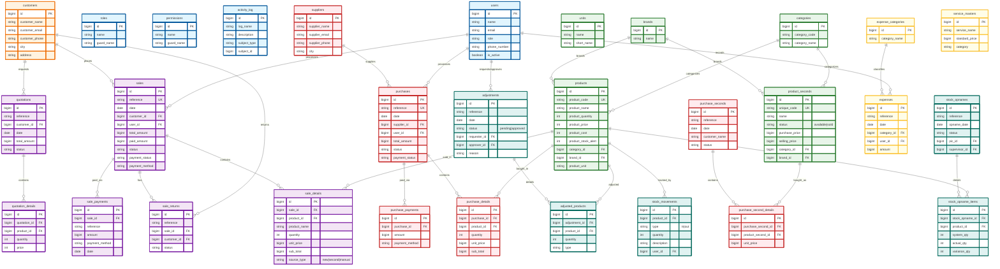

```mermaid
erDiagram
    %% --- User Management (BLUE) ---
    users {
        bigint id PK
        string name
        string email
        string role
        string phone_number
        boolean is_active
    }
    roles {
        bigint id PK
        string name
        string guard_name
    }
    permissions {
        bigint id PK
        string name
        string guard_name
    }
    activity_log {
        bigint id PK
        string log_name
        string description
        string subject_type
        bigint subject_id
    }

    %% --- Products & Inventory (GREEN) ---
    products {
        bigint id PK
        string product_code UK
        string product_name
        int product_quantity
        int product_price
        int product_cost
        int product_stock_alert
        bigint category_id FK
        bigint brand_id FK
        string product_unit
    }
    categories {
        bigint id PK
        string category_code
        string category_name
    }
    brands {
        bigint id PK
        string name
    }
    units {
        bigint id PK
        string name
        string short_name
    }
    product_seconds {
        bigint id PK
        string unique_code UK
        string name
        string status "available|sold"
        bigint purchase_price
        bigint selling_price
        bigint category_id FK
        bigint brand_id FK
    }

    %% --- Sales (PURPLE) ---
    sales {
        bigint id PK
        string reference UK
        date date
        bigint customer_id FK
        bigint user_id FK
        bigint total_amount
        bigint paid_amount
        string status
        string payment_status
        string payment_method
    }
    sale_details {
        bigint id PK
        bigint sale_id FK
        bigint product_id FK
        string product_name
        int quantity
        bigint unit_price
        bigint sub_total
        string source_type "new|second|manual"
    }
    sale_payments {
        bigint id PK
        bigint sale_id FK
        string reference
        bigint amount
        string payment_method
        date date
    }
    sale_returns {
        bigint id PK
        string reference
        bigint sale_id FK
        bigint customer_id FK
        string status
    }
    quotations {
        bigint id PK
        string reference
        bigint customer_id FK
        date date
        bigint total_amount
        string status
    }
    quotation_details {
        bigint id PK
        bigint quotation_id FK
        bigint product_id FK
        int quantity
        int price
    }

    %% --- Customers (ORANGE) ---
    customers {
        bigint id PK
        string customer_name
        string customer_email
        string customer_phone
        string city
        string address
    }

    %% --- Purchases (RED) ---
    purchases {
        bigint id PK
        string reference UK
        date date
        bigint supplier_id FK
        bigint user_id FK
        bigint total_amount
        string status
        string payment_status
    }
    purchase_details {
        bigint id PK
        bigint purchase_id FK
        bigint product_id FK
        int quantity
        bigint unit_price
        bigint sub_total
    }
    purchase_payments {
        bigint id PK
        bigint purchase_id FK
        bigint amount
        string payment_method
    }
    suppliers {
        bigint id PK
        string supplier_name
        string supplier_email
        string supplier_phone
        string city
    }
    purchase_seconds {
        bigint id PK
        string reference
        date date
        string customer_name
        string status
    }
    purchase_second_details {
        bigint id PK
        bigint purchase_second_id FK
        bigint product_second_id FK
        bigint unit_price
    }

    %% --- Stock Control (TEAL) ---
    stock_movements {
        bigint id PK
        bigint product_id FK
        string type "in|out"
        int quantity
        string description
        bigint user_id FK
    }
    adjustments {
        bigint id PK
        string reference
        date date
        string status "pending|approved"
        bigint requester_id FK
        bigint approver_id FK
        string reason
    }
    adjusted_products {
        bigint id PK
        bigint adjustment_id FK
        bigint product_id FK
        int quantity
        string type
    }
    stock_opnames {
        bigint id PK
        string reference
        date opname_date
        string status
        bigint pic_id FK
        bigint supervisor_id FK
    }
    stock_opname_items {
        bigint id PK
        bigint stock_opname_id FK
        bigint product_id FK
        int system_qty
        int actual_qty
        int variance_qty
    }

    %% --- Expenses & Finance (YELLOW) ---
    expenses {
        bigint id PK
        string reference
        date date
        bigint category_id FK
        bigint user_id FK
        bigint amount
    }
    expense_categories {
        bigint id PK
        string category_name
    }
    service_masters {
        bigint id PK
        string service_name
        bigint standard_price
        string category
    }

    %% --- Relationships ---

    %% Users & Auth
    users ||--o{ sales : "processes"
    users ||--o{ purchases : "processes"
    users ||--o{ expenses : "records"
    users ||--o{ adjustments : "requests/approves"

    %% Products
    categories ||--o{ products : "categorizes"
    brands ||--o{ products : "brands"
    products ||--o{ sale_details : "sold_in"
    products ||--o{ purchase_details : "bought_in"
    products ||--o{ stock_movements : "tracked_by"
    products ||--o{ adjusted_products : "adjusted"
    products ||--o{ stock_opname_items : "audited"

    %% Seconds
    categories ||--o{ product_seconds : "categorizes"
    brands ||--o{ product_seconds : "brands"
    product_seconds ||--o{ purchase_second_details : "bought_as"

    %% Sales
    customers ||--o{ sales : "places"
    customers ||--o{ quotations : "requests"
    customers ||--o{ sale_returns : "returns"
    sales ||--o{ sale_details : "contains"
    sales ||--o{ sale_payments : "paid_via"
    sales ||--o{ sale_returns : "has"
    quotations ||--o{ quotation_details : "contains"

    %% Purchases
    suppliers ||--o{ purchases : "supplies"
    purchases ||--o{ purchase_details : "contains"
    purchases ||--o{ purchase_payments : "paid_via"
    purchase_seconds ||--o{ purchase_second_details : "contains"

    %% Expenses
    expense_categories ||--o{ expenses : "classifies"

    %% Stock Control
    adjustments ||--o{ adjusted_products : "details"
    stock_opnames ||--o{ stock_opname_items : "details"


    %% --- Styling Classes ---
    classDef blue fill:#e1f5fe,stroke:#01579b,stroke-width:2px
    classDef green fill:#e8f5e9,stroke:#2e7d32,stroke-width:2px
    classDef purple fill:#f3e5f5,stroke:#7b1fa2,stroke-width:2px
    classDef red fill:#ffebee,stroke:#c62828,stroke-width:2px
    classDef orange fill:#fff3e0,stroke:#ef6c00,stroke-width:2px
    classDef teal fill:#e0f2f1,stroke:#00695c,stroke-width:2px
    classDef yellow fill:#fffde7,stroke:#fbc02d,stroke-width:2px

    class users,roles,permissions,activity_log blue
    class products,categories,brands,units,product_seconds green
    class sales,sale_details,sale_payments,sale_returns,quotations,quotation_details purple
    class purchases,purchase_details,purchase_payments,suppliers,purchase_seconds,purchase_second_details red
    class customers orange
    class stock_movements,adjustments,adjusted_products,stock_opnames,stock_opname_items teal
    class expenses,expense_categories,service_masters yellow
```
