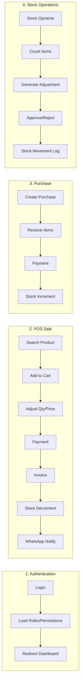
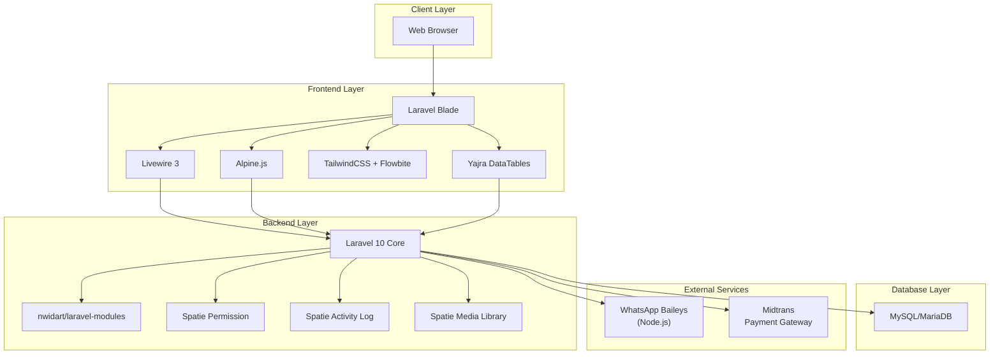
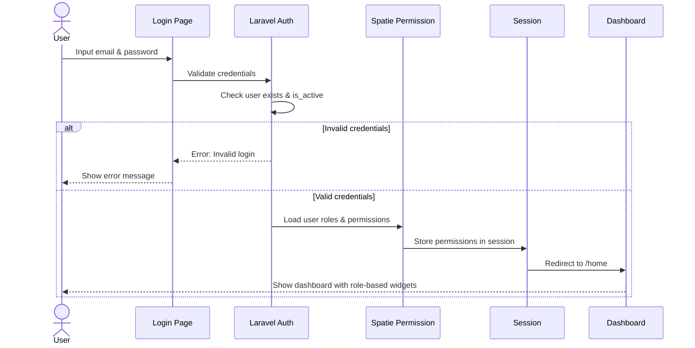
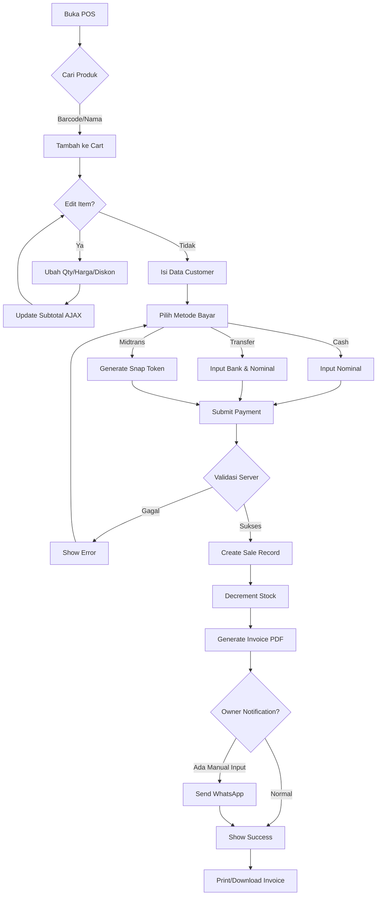
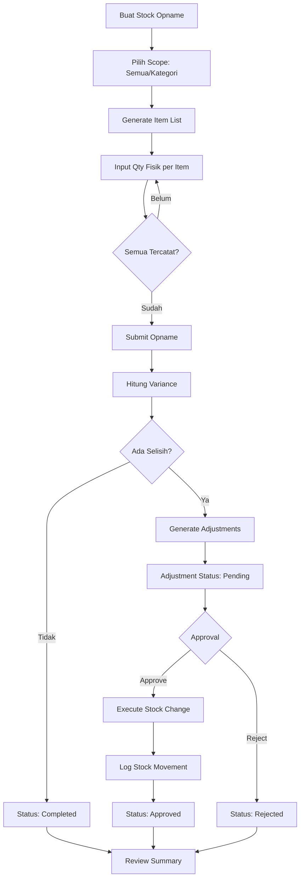
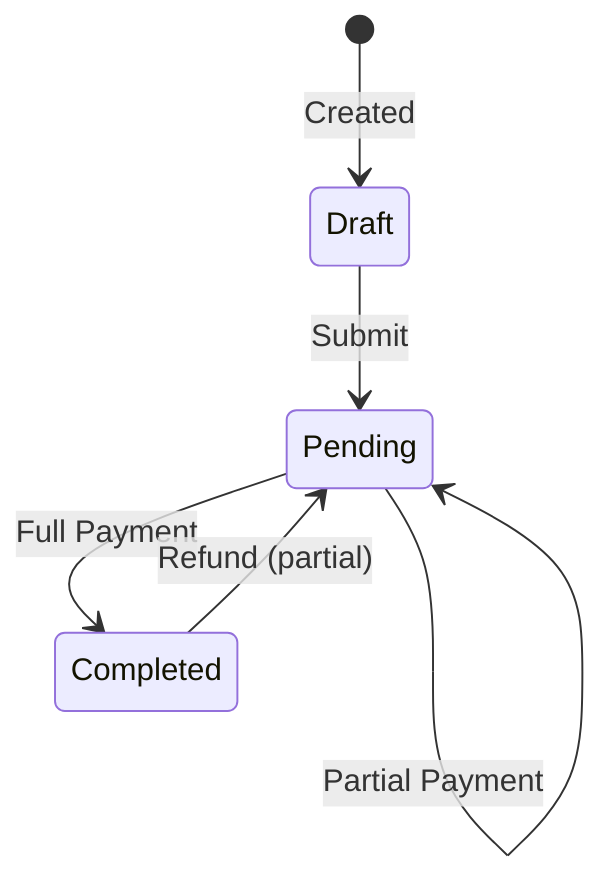
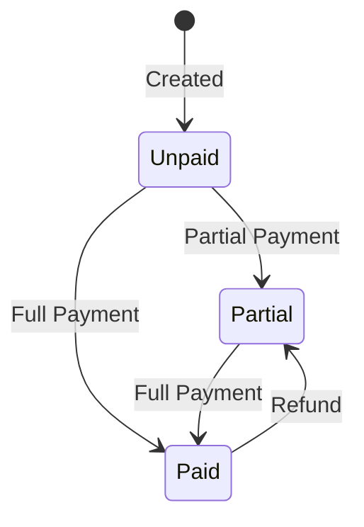

# 📋 Spesifikasi Produk: Omah Ban - Sistem POS

## Daftar Isi

- [A. Executive Summary](#a-executive-summary)
- [B. System Overview](#b-system-overview)
- [C. Architecture](#c-architecture)
- [D. Business Process & Flow](#d-business-process--flow)
- [E. Frontend Specification](#e-frontend-specification)
- [F. Backend Specification](#f-backend-specification)
- [G. Data & Reporting](#g-data--reporting)
- [H. Testing & Verification](#h-testing--verification)
- [I. Deployment & Environment](#i-deployment--environment)
- [J. Future Enhancements](#j-future-enhancements)

---

## A. Executive Summary

### A.1 Tentang Aplikasi

**Omah Ban** adalah sistem _Point of Sale_ (POS) berbasis web yang dirancang khusus untuk toko ban dan aksesoris otomotif. Aplikasi ini menyediakan solusi komprehensif untuk:

- Manajemen transaksi penjualan (_sales_) dan pembelian (_purchases_)
- Pelacakan inventaris produk baru dan bekas (_second_)
- Perhitungan laba-rugi dan HPP (_Harga Pokok Penjualan_) secara real-time
- Sistem kontrol akses berbasis peran (_role-based access control_)
- Pelaporan bisnis dan notifikasi otomatis via WhatsApp

### A.2 Nilai Utama (_Primary Value_)

| Aspek                     | Nilai                                                                            |
| ------------------------- | -------------------------------------------------------------------------------- |
| **Efisiensi Operasional** | Mempercepat proses checkout POS dengan _real-time search_ dan kalkulasi otomatis |
| **Transparansi Keuangan** | Pelacakan HPP, laba per transaksi, dan laporan keuangan akurat                   |
| **Kontrol Stok**          | _Stock opname_, adjustment, dan _movement log_ untuk audit trail                 |
| **Keamanan Data**         | Role-based permission untuk membatasi akses sesuai jabatan                       |
| **Notifikasi Real-time**  | WhatsApp notification untuk owner saat ada transaksi penting                     |

### A.3 Kriteria Keberhasilan

1. Kasir dapat menyelesaikan transaksi POS dalam waktu < 2 menit
2. Owner dapat memantau penjualan harian via WhatsApp notification
3. Selisih stok fisik vs sistem < 1% setelah _stock opname_
4. Semua laporan keuangan dapat di-export ke Excel/PDF
5. Sistem dapat diakses oleh 3+ user secara bersamaan tanpa konflik

---

## B. System Overview

### B.1 Scope (Dalam Cakupan)

| Modul          | Fitur Utama                                                                   |
| -------------- | ----------------------------------------------------------------------------- |
| **Sale**       | POS, invoice, pembayaran (cash/transfer/Midtrans), retur penjualan, quotation |
| **Product**    | Katalog produk baru/bekas, kategori, brand, barcode, gambar produk            |
| **Purchase**   | Pembelian dari supplier, pembayaran cicilan, penerimaan barang                |
| **People**     | Manajemen customer dan supplier dengan riwayat transaksi                      |
| **Expense**    | Pencatatan pengeluaran operasional dengan kategori                            |
| **Adjustment** | _Stock adjustment_, _stock opname_, _stock movement log_                      |
| **Reports**    | Laporan penjualan, laba-rugi, stok rendah, ringkasan kasir                    |
| **Setting**    | Konfigurasi sistem, satuan unit, kop surat                                    |
| **User**       | Manajemen user, role, dan permission                                          |
| **WhatsApp**   | Notifikasi otomatis ke owner via Baileys                                      |

### B.2 Non-Scope (Di Luar Cakupan)

> [!IMPORTANT]
> Fitur-fitur berikut **TIDAK** termasuk dalam cakupan proyek ini:

- ❌ Integrasi _marketplace_ (Tokopedia, Shopee, Bukalapak)
- ❌ Manajemen multi-cabang (_multi-branch/franchise_)
- ❌ Aplikasi mobile untuk customer (_customer-facing mobile app_)
- ❌ Sistem _loyalty program_ atau poin pelanggan
- ❌ Integrasi akuntansi eksternal (Jurnal, Accurate, dll)
- ❌ _E-commerce_ atau penjualan online

### B.3 User Roles & Responsibilities

| Role             | Tanggung Jawab                                   | Permission Utama                                                |
| ---------------- | ------------------------------------------------ | --------------------------------------------------------------- |
| **Super Admin**  | Akses penuh ke seluruh sistem                    | Semua permission (bypass check)                                 |
| **Owner/Admin**  | Mengelola setting, user, melihat laporan lengkap | `access_settings`, `access_user_management`, `access_reports`   |
| **Kasir**        | Memproses transaksi POS, menerima pembayaran     | `create_pos_sales`, `access_sales`, `show_products`             |
| **Admin Gudang** | Mengelola stok, adjustment, pembelian            | `access_adjustments`, `access_stock_opname`, `access_purchases` |

### B.4 Key Workflows (High-Level)



---

## C. Architecture

### C.1 High-Level Architecture



### C.2 Frontend Architecture

| Komponen                      | Teknologi              | Fungsi                               |
| ----------------------------- | ---------------------- | ------------------------------------ |
| **Template Engine**           | Laravel Blade          | Rendering HTML dengan syntax PHP     |
| **Reactive Components**       | Livewire 3             | Real-time update tanpa full reload   |
| **Client-side Interactivity** | Alpine.js              | DOM manipulation ringan              |
| **CSS Framework**             | TailwindCSS + Flowbite | Styling responsif dengan komponen UI |
| **Data Tables**               | Yajra DataTables       | Server-side pagination dan filtering |
| **Currency Input**            | AutoNumeric.js         | Format input mata uang IDR           |
| **Notifications**             | SweetAlert2            | Konfirmasi dan alert dialog          |
| **Build Tool**                | Vite                   | Asset bundling dan HMR               |

### C.3 Backend Architecture

```
app/
├── Console/Commands/       # Artisan commands (TestNotification, etc.)
├── Exports/                # Excel export classes (Maatwebsite)
├── Helpers/                # Helper functions (format_currency, etc.)
├── Http/
│   ├── Controllers/        # Web controllers
│   ├── Middleware/         # CheckPermission, etc.
│   └── Requests/           # Form Request validation
├── Livewire/               # Livewire components (Reports, etc.)
├── Models/                 # Core Eloquent models (User, OwnerNotification)
├── Providers/              # Service providers
└── Services/
    ├── Midtrans/           # Payment gateway integration
    └── WhatsApp/           # BaileysNotificationService

Modules/
├── Sale/                   # POS, Sales, Payments, Returns, Quotation
├── Product/                # Products, ProductSecond, Category, Brand
├── Purchase/               # Purchases, PurchasePayments
├── People/                 # Customer, Supplier
├── Expense/                # Expense, ExpenseCategory
├── Adjustment/             # Adjustment, StockOpname, StockMovement
├── Reports/                # Livewire report components
├── Setting/                # System settings, Units
├── User/                   # User management, Roles, Permissions
├── Currency/               # Currency configuration
└── Upload/                 # File upload management
```

### C.4 Database Approach

- **RDBMS**: MySQL 5.7+ / MariaDB 10.3+
- **Audit Fields**: Semua tabel memiliki `created_at`, `updated_at`
- **Soft Deletes**: Tabel kritis (`products`, `customers`, `suppliers`, `sales`) menggunakan `deleted_at`
- **Stock Movement Strategy**: Polymorphic relation (`productable_type`, `productable_id`) untuk tracking pergerakan stok dari berbagai sumber (Sale, Purchase, Adjustment)
- **Money Storage**: Integer dalam satuan Rupiah (tanpa desimal) untuk menghindari floating-point errors

---

## D. Business Process & Flow

### D.1 Authentication & Role-Based Access



### D.2 POS Checkout Workflow



### D.3 Stock Adjustment/Opname Flow



### D.4 Use Case Matrix per Role

| Use Case                 | Owner/Admin |        Kasir        |   Warehouse   |
| ------------------------ | :---------: | :-----------------: | :-----------: |
| Login ke sistem          |     ✅      |         ✅          |      ✅       |
| Lihat dashboard          |     ✅      |    ✅ (terbatas)    | ✅ (terbatas) |
| Akses POS                |     ✅      |         ✅          |      ❌       |
| Buat transaksi penjualan |     ✅      |         ✅          |      ❌       |
| Edit harga di POS        |     ✅      | ⚠️ (perlu approval) |      ❌       |
| Lihat laporan penjualan  |     ✅      |    ✅ (terbatas)    |      ❌       |
| Export laporan Excel/PDF |     ✅      |         ❌          |      ❌       |
| CRUD Produk              |     ✅      |         ❌          |      ✅       |
| CRUD Customer            |     ✅      |         ✅          |      ❌       |
| CRUD Supplier            |     ✅      |         ❌          |      ✅       |
| Buat pembelian           |     ✅      |         ❌          |      ✅       |
| Stock adjustment         |     ✅      |         ❌          |      ✅       |
| Approve adjustment       |     ✅      |         ❌          |      ❌       |
| Stock opname             |     ✅      |         ❌          |      ✅       |
| Kelola user & role       |     ✅      |         ❌          |      ❌       |
| Akses pengaturan         |     ✅      |         ❌          |      ❌       |
| Terima notifikasi WA     |     ✅      |         ❌          |      ❌       |

---

## E. Frontend Specification

### E.1 Information Architecture

```
/ (Login)
├── /home (Dashboard)
├── /app/pos (POS Checkout)
├── /sales
│   ├── / (List)
│   ├── /{id} (Detail)
│   └── /{id}/edit
├── /products
│   ├── /baru (Produk Baru)
│   └── /second (Produk Bekas)
├── /purchases
│   ├── /baru
│   └── /second
├── /people
│   ├── /customers
│   └── /suppliers
├── /expenses
├── /adjustments
│   ├── / (List)
│   └── /stock-opname
├── /reports
│   ├── /daily
│   ├── /profit-loss
│   └── /low-stock
├── /users
│   ├── / (List)
│   └── /roles
├── /pengaturan (Settings)
└── /whatsapp/settings
```

### E.2 Page Specifications

#### E.2.1 Login Page (`/`)

| Aspek       | Spesifikasi                     |
| ----------- | ------------------------------- |
| **Purpose** | Autentikasi user ke sistem      |
| **URL**     | `/` (redirect jika sudah login) |
| **Layout**  | Guest layout (tanpa sidebar)    |

**Form Fields:**

| Field    | Type     | Validation                    | Default |
| -------- | -------- | ----------------------------- | ------- |
| email    | email    | required, email, exists:users | -       |
| password | password | required, min:8               | -       |
| remember | checkbox | optional                      | false   |

**User Interactions:**

- _Happy path_: Input valid → redirect `/home`
- _Edge case_: User tidak aktif → "Akun Anda dinonaktifkan"
- _Edge case_: Password salah 5x → rate limited 60 detik

---

#### E.2.2 Dashboard (`/home`)

| Aspek          | Spesifikasi                               |
| -------------- | ----------------------------------------- |
| **Purpose**    | Overview statistik bisnis harian          |
| **Permission** | `show_total_stats`, `show_month_overview` |

**UI Components:**

| Komponen          | Deskripsi                                            | Permission                    |
| ----------------- | ---------------------------------------------------- | ----------------------------- |
| Stats Cards       | Total penjualan, pembelian, expense, profit hari ini | `show_total_stats`            |
| Sales Chart       | Grafik penjualan vs pembelian mingguan               | `show_weekly_sales_purchases` |
| Monthly Chart     | Grafik pendapatan bulanan                            | `show_month_overview`         |
| Notification Bell | Badge unread notifications                           | `show_notifications`          |

---

#### E.2.3 POS Checkout (`/app/pos`)

| Aspek          | Spesifikasi                       |
| -------------- | --------------------------------- |
| **Purpose**    | Membuat transaksi penjualan cepat |
| **Permission** | `create_pos_sales`                |

**UI Layout:**

```
┌─────────────────────────────────────────────────────────────┐
│ [Search Bar: Cari produk...] [Barcode Scanner]              │
├─────────────────────────────────────────────────────────────┤
│ ┌─────────────────────────┐ ┌─────────────────────────────┐ │
│ │    Product Grid         │ │      Cart Panel             │ │
│ │  ┌────┐ ┌────┐ ┌────┐  │ │  ┌─────────────────────────┐ │ │
│ │  │ 🛞 │ │ 🛞 │ │ 🛞 │  │ │  │ Item 1        Rp 500.000│ │ │
│ │  └────┘ └────┘ └────┘  │ │  │ Item 2        Rp 750.000│ │ │
│ │  ┌────┐ ┌────┐ ┌────┐  │ │  ├─────────────────────────┤ │ │
│ │  │ 🛞 │ │ 🛞 │ │ 🛞 │  │ │  │ Subtotal    Rp 1.250.000│ │ │
│ │  └────┘ └────┘ └────┘  │ │  │ Tax (0%)            Rp 0│ │ │
│ │                        │ │  │ Discount            Rp 0│ │ │
│ │                        │ │  │ ─────────────────────── │ │ │
│ │                        │ │  │ TOTAL       Rp 1.250.000│ │ │
│ └─────────────────────────┘ │  └─────────────────────────┘ │ │
│                             │  [     BAYAR SEKARANG      ] │ │
│                             └─────────────────────────────┘ │
└─────────────────────────────────────────────────────────────┘
```

**Cart Item Fields (per row):**

| Field    | Type   | Validation      | Format           |
| -------- | ------ | --------------- | ---------------- |
| qty      | number | required, min:1 | Integer          |
| price    | text   | required, min:0 | AutoNumeric (Rp) |
| discount | text   | optional, min:0 | AutoNumeric (Rp) |
| tax      | text   | optional, 0-100 | Percentage       |

**Payment Modal Fields:**

| Field          | Type     | Validation                          | Condition              |
| -------------- | -------- | ----------------------------------- | ---------------------- |
| payment_method | select   | required                            | cash/transfer/midtrans |
| bank_name      | text     | required_if:payment_method,transfer | -                      |
| paid_amount    | text     | required, min:total                 | AutoNumeric            |
| customer_id    | select   | optional                            | Dropdown customers     |
| customer_name  | text     | required_if:customer_id,null        | Guest name             |
| note           | textarea | optional, max:500                   | -                      |

---

#### E.2.4 Products Page (`/products/baru`)

| Aspek          | Spesifikasi                                                              |
| -------------- | ------------------------------------------------------------------------ |
| **Purpose**    | CRUD produk baru (new condition)                                         |
| **Permission** | `access_products`, `create_products`, `edit_products`, `delete_products` |

**DataTable Columns:**

| Column      | Sortable | Searchable |
| ----------- | :------: | :--------: |
| Foto        |    ❌    |     ❌     |
| Kode Produk |    ✅    |     ✅     |
| Nama Produk |    ✅    |     ✅     |
| Kategori    |    ✅    |     ✅     |
| Brand       |    ✅    |     ✅     |
| Stok        |    ✅    |     ❌     |
| Harga Jual  |    ✅    |     ❌     |
| Status      |    ✅    |     ❌     |
| Aksi        |    ❌    |     ❌     |

**Create/Edit Form Fields:**

| Field               | Type     | Validation                        | Default       |
| ------------------- | -------- | --------------------------------- | ------------- |
| product_code        | text     | required, unique:products, max:50 | Auto-generate |
| product_name        | text     | required, max:191                 | -             |
| category_id         | select   | required, exists:categories       | -             |
| brand_id            | select   | required, exists:brands           | -             |
| barcode             | text     | optional, unique:products,barcode | -             |
| product_cost        | text     | required, min:0                   | 0             |
| product_price       | text     | required, min:0                   | 0             |
| product_quantity    | number   | required, min:0                   | 0             |
| product_stock_alert | number   | optional, min:0                   | 10            |
| product_note        | textarea | optional, max:1000                | -             |
| image               | file     | optional, image, max:2MB          | -             |

---

### E.3 UI/UX Rules

| Aspek               | Aturan                                                           |
| ------------------- | ---------------------------------------------------------------- |
| **Responsiveness**  | Semua halaman harus responsif untuk tablet (min-width: 768px)    |
| **Loading States**  | Gunakan skeleton loader atau spinner saat fetching data          |
| **Empty States**    | Tampilkan ilustrasi dan pesan "Tidak ada data"                   |
| **Error Messages**  | Tampilkan di bawah field dengan warna merah (#EF4444)            |
| **Confirmation**    | Gunakan SweetAlert2 untuk aksi destruktif (delete, cancel)       |
| **Currency Format** | Semua input uang menggunakan AutoNumeric dengan format Indonesia |
| **Date Format**     | Display: `d M Y` (10 Des 2025), Input: `Y-m-d`                   |

### E.4 Frontend Security

| Aspek                  | Implementasi                                                         |
| ---------------------- | -------------------------------------------------------------------- |
| **CSRF Protection**    | Semua form menggunakan `@csrf` directive                             |
| **XSS Prevention**     | Output menggunakan `{{ }}` (escaped) bukan `{!! !!}`                 |
| **Input Sanitization** | Client-side validation sebagai hint, server-side sebagai enforcement |
| **Secure Cookies**     | `httponly`, `secure` (production), `samesite=strict`                 |

---

## F. Backend Specification

### F.1 Data Models

#### F.1.1 Sales

| Column              | Type         | Constraints             | Description                          |
| ------------------- | ------------ | ----------------------- | ------------------------------------ |
| id                  | BIGINT       | PK, AUTO_INCREMENT      | -                                    |
| reference           | VARCHAR(191) | NOT NULL, UNIQUE        | Invoice number (OB2-YYYYMMDD-XXXXXX) |
| date                | DATETIME     | NOT NULL                | Tanggal transaksi                    |
| customer_id         | BIGINT       | FK, NULLABLE            | Relasi ke customers                  |
| customer_name       | VARCHAR(191) | NULLABLE                | Fallback jika guest                  |
| user_id             | BIGINT       | FK, NOT NULL            | Kasir yang membuat                   |
| total_amount        | BIGINT       | NOT NULL, DEFAULT 0     | Total transaksi (IDR)                |
| paid_amount         | BIGINT       | NOT NULL, DEFAULT 0     | Jumlah dibayar                       |
| due_amount          | BIGINT       | NOT NULL, DEFAULT 0     | Sisa tagihan                         |
| total_hpp           | BIGINT       | DEFAULT 0               | Total HPP                            |
| total_profit        | BIGINT       | DEFAULT 0               | Total profit                         |
| tax_percentage      | INT          | DEFAULT 0               | Persentase pajak                     |
| discount_percentage | INT          | DEFAULT 0               | Persentase diskon                    |
| shipping_amount     | BIGINT       | DEFAULT 0               | Biaya kirim                          |
| status              | ENUM         | Draft/Pending/Completed | Status transaksi                     |
| payment_status      | ENUM         | Unpaid/Partial/Paid     | Status pembayaran                    |
| payment_method      | VARCHAR(50)  | NULLABLE                | cash/transfer/midtrans               |
| has_manual_input    | BOOLEAN      | DEFAULT FALSE           | Flag ada item manual                 |
| created_at          | TIMESTAMP    | -                       | -                                    |
| updated_at          | TIMESTAMP    | -                       | -                                    |
| deleted_at          | TIMESTAMP    | NULLABLE                | Soft delete                          |

**Relationships:**

- `belongsTo` Customer
- `belongsTo` User
- `hasMany` SaleDetails
- `hasMany` SalePayments

---

#### F.1.2 Products

| Column              | Type         | Constraints      | Description        |
| ------------------- | ------------ | ---------------- | ------------------ |
| id                  | BIGINT       | PK               | -                  |
| product_code        | VARCHAR(50)  | UNIQUE, NOT NULL | Kode produk        |
| product_name        | VARCHAR(191) | NOT NULL         | Nama produk        |
| barcode             | VARCHAR(100) | UNIQUE, NULLABLE | Barcode            |
| category_id         | BIGINT       | FK               | Kategori           |
| brand_id            | BIGINT       | FK               | Brand              |
| product_cost        | BIGINT       | NOT NULL         | Harga beli (HPP)   |
| product_price       | BIGINT       | NOT NULL         | Harga jual         |
| product_quantity    | INT          | DEFAULT 0        | Stok saat ini      |
| product_stock_alert | INT          | DEFAULT 10       | Batas stok minimum |
| product_note        | TEXT         | NULLABLE         | Keterangan         |
| is_active           | BOOLEAN      | DEFAULT TRUE     | Status aktif       |
| created_at          | TIMESTAMP    | -                | -                  |
| updated_at          | TIMESTAMP    | -                | -                  |
| deleted_at          | TIMESTAMP    | NULLABLE         | Soft delete        |

---

### F.2 Business Rules & Validations

#### F.2.1 Sale Validations

| Rule                                       | Enforcement                      |
| ------------------------------------------ | -------------------------------- |
| Cart tidak boleh kosong saat checkout      | Server-side check sebelum create |
| `total_amount` harus ≥ 0                   | Database constraint + validation |
| `paid_amount` tidak boleh > `total_amount` | Server-side validation           |
| Produk second hanya qty = 1                | Forced di POS dan edit           |
| Stock tidak boleh negatif setelah sale     | Pre-check sebelum decrement      |

#### F.2.2 Product Validations

| Rule                               | Enforcement                |
| ---------------------------------- | -------------------------- |
| `product_code` harus unique        | Database UNIQUE constraint |
| `product_price` ≥ `product_cost`   | Warning (tidak hard block) |
| `product_quantity` ≥ 0             | Database constraint        |
| Image max 2MB, format jpg/png/webp | Form Request validation    |

### F.3 Authorization Matrix

| Permission               | Admin | Kasir | Warehouse |
| ------------------------ | :---: | :---: | :-------: |
| `access_products`        |  ✅   |  ❌   |    ✅     |
| `create_products`        |  ✅   |  ❌   |    ✅     |
| `edit_products`          |  ✅   |  ❌   |    ✅     |
| `delete_products`        |  ✅   |  ❌   |    ❌     |
| `access_sales`           |  ✅   |  ✅   |    ❌     |
| `create_pos_sales`       |  ✅   |  ✅   |    ❌     |
| `edit_sales`             |  ✅   |  ❌   |    ❌     |
| `delete_sales`           |  ✅   |  ❌   |    ❌     |
| `access_purchases`       |  ✅   |  ❌   |    ✅     |
| `access_adjustments`     |  ✅   |  ❌   |    ✅     |
| `approve_adjustments`    |  ✅   |  ❌   |    ❌     |
| `access_stock_opname`    |  ✅   |  ❌   |    ✅     |
| `access_reports`         |  ✅   |  ❌   |    ❌     |
| `access_settings`        |  ✅   |  ❌   |    ❌     |
| `access_user_management` |  ✅   |  ❌   |    ❌     |

### F.4 API Endpoints

#### F.4.1 REST API (Sanctum Protected)

| Method | Endpoint                   | Description             | Auth    |
| ------ | -------------------------- | ----------------------- | ------- |
| GET    | `/api/products`            | List produk (paginated) | Sanctum |
| GET    | `/api/products/{id}`       | Detail produk           | Sanctum |
| GET    | `/api/products/low-stock`  | Produk stok rendah      | Sanctum |
| PATCH  | `/api/products/{id}/stock` | Update stok             | Sanctum |
| GET    | `/api/sales`               | List penjualan          | Sanctum |
| GET    | `/api/sales/{id}`          | Detail penjualan        | Sanctum |
| GET    | `/api/sales/summary`       | Ringkasan penjualan     | Sanctum |
| GET    | `/api/sales/daily`         | Penjualan harian        | Sanctum |
| GET    | `/api/health`              | Health check            | Public  |
| POST   | `/api/midtrans/callback`   | Midtrans webhook        | Public  |

#### F.4.2 Internal AJAX Endpoints

| Method | Endpoint                             | Description          |
| ------ | ------------------------------------ | -------------------- |
| POST   | `/sales/cart/update-line`            | Update item di cart  |
| POST   | `/sales/cart/line/add-manual`        | Tambah item manual   |
| POST   | `/sales/cart/line/remove`            | Hapus item dari cart |
| POST   | `/sale-payments/ajax/store`          | Simpan pembayaran    |
| GET    | `/sale-payments/ajax/summary/{sale}` | Ringkasan pembayaran |

### F.5 Status Transitions

#### F.5.1 Sale Status



#### F.5.2 Payment Status



### F.6 WhatsApp Notification Logic

**Trigger Conditions:**

| Event              | Condition                         | Template              |
| ------------------ | --------------------------------- | --------------------- |
| Manual Input Alert | `has_manual_input = true`         | manual_input template |
| Low Stock Alert    | `product_quantity <= stock_alert` | low_stock template    |
| Daily Report       | Scheduled (cron)                  | daily_report template |

**Payload Example (Manual Input):**

```
🔔 *⚠️ Input Manual - Inv OB2-20251222-000001*

Kasir *John* membuat transaksi dengan *2 item* input manual:

• Jasa Balancing: Rp 50.000
• Jasa Spooring: Rp 100.000

💰 *Total: Rp 150.000*
📋 Invoice: OB2-20251222-000001
⏰ Waktu: 22 Des 2025, 18:30
```

---

## G. Data & Reporting

### G.1 Report Types

| Report              | Filters         | Export     | Calculation                     |
| ------------------- | --------------- | ---------- | ------------------------------- |
| **Laporan Harian**  | Tanggal, Kasir  | Excel, PDF | Sum(total_amount), Count(sales) |
| **Profit Loss**     | Periode, Status | Excel      | Revenue - HPP - Expense         |
| **Ringkasan Kasir** | Periode, User   | Excel      | Group by user_id                |
| **Low Stock**       | Threshold       | Excel      | WHERE qty <= alert              |
| **Stock Movement**  | Periode, Produk | Excel      | Log semua pergerakan            |

### G.2 Calculation Logic

| Metric         | Formula                                         |
| -------------- | ----------------------------------------------- |
| `total_amount` | Σ(item_price × qty) - discount + tax + shipping |
| `total_hpp`    | Σ(item_cost × qty)                              |
| `total_profit` | `total_amount` - `total_hpp`                    |
| `gross_margin` | (`total_profit` / `total_amount`) × 100%        |
| `net_profit`   | `total_profit` - expenses                       |

### G.3 Audit Trail

- **Activity Log**: Menggunakan Spatie Activity Log untuk record perubahan pada entity kritis
- **Stock Movement**: Setiap perubahan stok tercatat dengan `source_type`, `source_id`, `qty_before`, `qty_after`
- **Payment History**: Setiap pembayaran tercatat dengan `reference`, `amount`, `method`, `date`

---

## H. Testing & Verification

### H.1 Black-Box Testing Plan

| TC-ID  | Feature                       | Preconditions               | Steps                                                                  | Expected Output                         |
| ------ | ----------------------------- | --------------------------- | ---------------------------------------------------------------------- | --------------------------------------- |
| TC-001 | Login Valid                   | User aktif ada di DB        | 1. Buka `/` 2. Input email valid 3. Input password valid 4. Klik Login | Redirect ke `/home`, session created    |
| TC-002 | Login Invalid Password        | User ada di DB              | 1. Input email valid 2. Input password salah                           | Error "Email atau password salah"       |
| TC-003 | Login User Nonaktif           | User `is_active=0`          | 1. Input credentials valid                                             | Error "Akun dinonaktifkan"              |
| TC-004 | Create Product                | Login sebagai Admin         | 1. Buka `/products/baru/create` 2. Isi form lengkap 3. Submit          | Produk tersimpan, redirect ke list      |
| TC-005 | Create Product Duplicate Code | Produk dengan kode sama ada | 1. Input `product_code` yang sudah ada                                 | Error "Kode produk sudah digunakan"     |
| TC-006 | POS Add to Cart               | Login sebagai Kasir         | 1. Buka `/app/pos` 2. Search produk 3. Klik produk                     | Item masuk cart, subtotal update        |
| TC-007 | POS Checkout Cash             | Cart ada item               | 1. Klik Bayar 2. Pilih Cash 3. Input nominal >= total 4. Submit        | Sale created, invoice generated         |
| TC-008 | POS Checkout Insufficient     | Cart ada item               | 1. Input nominal < total                                               | Error "Nominal kurang"                  |
| TC-009 | Stock Adjustment Create       | Login sebagai Warehouse     | 1. Buka `/adjustments/create` 2. Pilih produk 3. Set qty 4. Submit     | Adjustment pending approval             |
| TC-010 | Stock Adjustment Approve      | Adjustment pending ada      | 1. Login Admin 2. Approve adjustment                                   | Stok berubah, status Approved           |
| TC-011 | Role Access Denied            | Login sebagai Kasir         | 1. Akses `/users`                                                      | 403 Forbidden                           |
| TC-012 | Report Export Excel           | Login sebagai Admin         | 1. Buka report 2. Klik Export Excel                                    | File .xlsx terdownload                  |
| TC-013 | Midtrans Callback             | Sale dengan Midtrans ada    | 1. POST callback dengan status settlement                              | Payment status = Paid                   |
| TC-014 | Stock Opname Complete         | Opname in_progress          | 1. Input semua qty fisik 2. Submit                                     | Adjustments generated jika ada variance |
| TC-015 | WhatsApp Test Message         | WA connected                | 1. Buka settings 2. Klik Test                                          | Pesan terkirim ke nomor owner           |

### H.2 UAT Evaluation Instrument

#### H.2.1 Indicators

| Indikator        | Deskripsi                    | Metode Ukur                    |
| ---------------- | ---------------------------- | ------------------------------ |
| **Usability**    | Kemudahan penggunaan sistem  | Skala Likert 1-5               |
| **Efficiency**   | Kecepatan menyelesaikan task | Waktu (menit)                  |
| **Correctness**  | Kebenaran hasil/output       | Persentase akurasi             |
| **Satisfaction** | Kepuasan pengguna            | Skala Likert 1-5               |
| **Learnability** | Kemudahan mempelajari sistem | Jumlah error saat pertama kali |

#### H.2.2 Questionnaire Items

**Untuk Owner/Admin:**

1. Seberapa mudah Anda memahami dashboard statistik? (1-5)
2. Apakah laporan keuangan sudah akurat sesuai ekspektasi? (Ya/Tidak)
3. Seberapa cepat Anda mendapat notifikasi WhatsApp setelah transaksi? (detik)
4. Fitur apa yang paling bermanfaat bagi Anda?
5. Fitur apa yang perlu ditingkatkan?

**Untuk Kasir:**

1. Berapa lama waktu rata-rata menyelesaikan 1 transaksi? (menit)
2. Seberapa mudah mencari produk di POS? (1-5)
3. Apakah kalkulasi total sudah benar? (Ya/Tidak)
4. Kendala apa yang sering Anda temui?

**Untuk Warehouse:**

1. Seberapa akurat hasil stock opname vs fisik? (%)
2. Apakah proses adjustment mudah dipahami? (1-5)
3. Berapa lama waktu untuk input 100 item opname? (menit)

### H.3 Risks & Limitations

| Risk                          | Impact                       | Mitigation                                       |
| ----------------------------- | ---------------------------- | ------------------------------------------------ |
| WhatsApp disconnect           | Owner tidak dapat notifikasi | Auto-reconnect + fallback ke in-app notification |
| Concurrent checkout same item | Stok negatif                 | Database transaction + stock locking             |
| Large data export             | Timeout/memory limit         | Chunked export + queue job                       |
| Midtrans callback delay       | Status tidak update          | Retry mechanism + manual check button            |

---

## I. Deployment & Environment

### I.1 Environments

| Environment | Purpose                    | URL                           |
| ----------- | -------------------------- | ----------------------------- |
| Development | Local development          | `http://projectomahban.test`  |
| Staging     | Testing sebelum production | `https://staging.omahban.com` |
| Production  | Live system                | `https://omahban.com`         |

### I.2 Dependencies

| Dependency    | Version       | Purpose                           |
| ------------- | ------------- | --------------------------------- |
| PHP           | >= 8.1        | Runtime                           |
| MySQL/MariaDB | >= 5.7 / 10.3 | Database                          |
| Composer      | >= 2.x        | PHP dependency manager            |
| Node.js       | >= 18.x       | Frontend build + WhatsApp service |
| wkhtmltopdf   | 0.12.x        | PDF generation                    |

### I.3 Environment Variables

```env
# Application
APP_NAME="Omah Ban"
APP_ENV=production
APP_DEBUG=false
APP_URL=https://omahban.com

# Database
DB_CONNECTION=mysql
DB_HOST=127.0.0.1
DB_PORT=3306
DB_DATABASE=project_omah_ban
DB_USERNAME=<username>
DB_PASSWORD=<password>

# Midtrans
MIDTRANS_SERVER_KEY=<server_key>
MIDTRANS_CLIENT_KEY=<client_key>
MIDTRANS_IS_PRODUCTION=true

# WhatsApp Baileys
WHATSAPP_DRIVER=baileys
WHATSAPP_BAILEYS_URL=http://localhost:3001
WHATSAPP_OWNER_PHONE=628xxxxxxxxxx
```

### I.4 Backup Strategy

| Type                 | Frequency     | Retention |
| -------------------- | ------------- | --------- |
| Database full backup | Daily (02:00) | 30 days   |
| Incremental backup   | Hourly        | 7 days    |
| Media files backup   | Weekly        | 90 days   |

---

## J. Future Enhancements

### J.1 Nice to Have (Realistis untuk Skripsi)

| Enhancement                 | Priority | Effort |
| --------------------------- | -------- | ------ |
| Mobile-responsive POS       | High     | Medium |
| Barcode scanner integration | Medium   | Low    |
| SMS fallback notification   | Low      | Low    |
| Dark mode toggle            | Low      | Low    |

### J.2 Out of Scope (Tetap Dikecualikan)

- ❌ Multi-branch management
- ❌ Marketplace integration
- ❌ Customer mobile app
- ❌ AI-based inventory forecasting

---

## Changelog

| Version | Date        | Changes                                      |
| ------- | ----------- | -------------------------------------------- |
| 1.0.0   | 22 Des 2025 | Initial product specification for Chapter IV |

---

> [!NOTE]
> Dokumen ini disusun sebagai Spesifikasi Produk untuk keperluan akademis (Bab IV - Implementasi dan Pengujian). Semua diagram, tabel, dan spesifikasi didasarkan pada analisis kode sumber aktual dari repository ProjectOmahBan.
